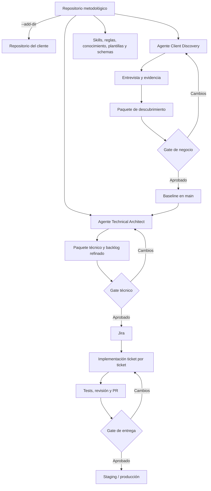

# Plan director para un sistema de desarrollo web freelance asistido por IA

**Versión:** 0.1  
**Fecha:** 10 de julio de 2026  
**Estado:** propuesta inicial para validar con proyectos reales  
**Enfoque:** proceso humano asistido por IA, manual primero y automatizable después

---

## Resumen ejecutivo

Este documento define el plan para construir un sistema de trabajo freelance de desarrollo web asistido por IA que cubra progresivamente el ciclo de vida completo del software: descubrimiento, adquisición de requisitos, diseño técnico, planificación, implementación, verificación, entrega, despliegue y gestión de cambios.

La recomendación principal es **no intentar automatizarlo todo desde el principio**. La primera versión debe ser un proceso manual pero estructurado, donde:

- tú actúas como orquestador y responsable final;
- Claude Code ejecuta roles especializados;
- un repositorio metodológico contiene la forma de trabajar;
- cada cliente tiene un repositorio independiente con su evidencia, documentación, código y estado;
- Git es la fuente de verdad;
- Jira es una vista operativa del backlog, no la fuente canónica de requisitos;
- los pasos importantes están separados por gates de revisión y aprobación;
- la metodología se valida antes de construir una aplicación web o workflows autónomos.

La arquitectura parte de dos agentes principales:

1. **Client Discovery & Requirements Architect**, que entrevista directamente al cliente una sola vez y obtiene requisitos de negocio, funcionales, no funcionales, operativos y técnicos que solo el cliente puede aportar.
2. **Technical Solution & UX Architect**, que te entrevista a ti a partir de la baseline aprobada y transforma las necesidades del cliente en decisiones de arquitectura, UX, seguridad, testing, despliegue y backlog de entrega.

Ambos agentes comparten una metodología, pero tienen responsabilidades, límites, skills y contratos de salida distintos.

La conexión se realiza ejecutando Claude Code desde el repositorio del cliente y añadiendo el repositorio metodológico como directorio adicional. Así:

- la sesión y la memoria pertenecen al cliente;
- las instrucciones y herramientas reutilizables proceden de la metodología;
- los artefactos se escriben en el repositorio del cliente;
- ningún dato del cliente debe guardarse en la metodología.

El objetivo inicial no es crear un SaaS. Es demostrar que el proceso produce de forma repetible entrevistas profundas, requisitos trazables, documentación técnica coherente, un backlog listo para implementar y tareas que Claude Code pueda ejecutar con supervisión razonable.

---

# 1. Objetivo del sistema

El sistema debe permitir que una sola persona opere como un pequeño equipo de producto y desarrollo apoyándose en agentes especializados y artefactos versionados.

No se pretende que la IA «haga una web sola». Se pretende construir un proceso donde cada etapa:

1. recibe entradas explícitas;
2. aplica un procedimiento especializado;
3. produce artefactos concretos;
4. es revisada o validada;
5. alimenta la siguiente etapa;
6. deja trazabilidad suficiente para detectar y corregir errores.

```text
Necesidad del cliente
        ↓
Evidencia de entrevista
        ↓
Requisitos aprobados
        ↓
Diseño técnico
        ↓
Backlog implementable
        ↓
Código y tests
        ↓
Verificación integrada
        ↓
Staging y validación
        ↓
Producción
        ↓
Cambios y mantenimiento
```

El valor diferencial estará principalmente en los primeros eslabones. Muchos modelos pueden generar código cuando reciben una especificación clara. El problema difícil es convertir conversaciones ambiguas con clientes no técnicos en especificaciones correctas, completas y verificables.

---

# 2. Decisiones arquitectónicas ya tomadas

## 2.1. Empezar de forma manual

La primera versión será operada por ti. No habrá paso automático entre fases, sincronización bidireccional ni agentes autónomos tomando decisiones irreversibles.

Esto permitirá aprender:

- qué preguntas funcionan;
- qué artefactos son útiles;
- dónde se repiten errores;
- qué tareas requieren criterio humano;
- qué pasos son suficientemente estables para automatizarlos.

La automatización debe aparecer como respuesta a una fricción repetida, no como objetivo inicial.

## 2.2. Una única entrevista formal con el cliente

No habrá una entrevista de negocio y otra entrevista técnica completa con el cliente. La entrevista principal debe obtener:

- objetivos y problemas;
- usuarios y stakeholders;
- procesos actuales;
- funcionalidades;
- reglas de negocio;
- alcance y prioridades;
- requisitos no funcionales;
- datos e integraciones;
- contexto técnico y operativo existente;
- presupuesto y plazos;
- propiedad de dominios, cuentas y activos;
- mantenimiento y administración futura;
- accesibilidad, privacidad y cumplimiento aplicables.

El cliente aporta necesidades, hechos, restricciones y contexto. No decide la arquitectura interna.

Si posteriormente aparece una duda imposible de anticipar, se crea una **aclaración puntual**, no una segunda entrevista completa.

## 2.3. Dos agentes principales separados

### Agente 1: Client Discovery & Requirements Architect

Entrevista al cliente.

Responsabilidades:

- conducir una entrevista adaptativa;
- detectar ambigüedades y contradicciones;
- reconstruir procesos;
- distinguir hechos, deseos, restricciones y suposiciones;
- obtener requisitos funcionales y no funcionales;
- recopilar el contexto técnico-operativo del cliente;
- confirmar resúmenes;
- generar el paquete inicial de descubrimiento.

Límites:

- no selecciona tecnologías;
- no diseña arquitectura;
- no convierte inferencias en hechos;
- no marca como aprobado algo no confirmado;
- no escribe datos del cliente en el repositorio metodológico.

### Agente 2: Technical Solution & UX Architect

Te entrevista a ti utilizando la baseline aprobada.

Responsabilidades:

- analizar viabilidad;
- identificar decisiones pendientes;
- comparar opciones y trade-offs;
- diseñar arquitectura y UX;
- definir datos, APIs, seguridad y despliegue;
- proponer estrategia de testing;
- registrar decisiones mediante ADR;
- convertir el backlog provisional en backlog de entrega.

Límites:

- no reinicia el descubrimiento de negocio;
- no modifica requisitos aprobados de forma silenciosa;
- no presenta decisiones técnicas como necesidades del cliente;
- cuando falta información que solo conoce el cliente, crea una aclaración específica.

## 2.4. Git es la fuente de verdad

Los artefactos importantes solo se consideran parte del proyecto cuando están guardados y versionados en el repositorio del cliente.

Claude Code es una herramienta de trabajo. Jira es una vista de planificación. Las conversaciones son evidencia. Ninguna sustituye al repositorio canónico.

## 2.5. Jira es una vista operativa

Jira contendrá epics, stories, tareas, responsables y estados. No será el lugar principal para requisitos canónicos, decisiones, contratos, reglas de negocio o evidencia.

Inicialmente, la dirección será:

```text
Git → Jira
```

No se implementará sincronización bidireccional hasta que exista una necesidad real y un modelo claro de resolución de conflictos.

## 2.6. La verificación ocurre en varios niveles

Habrá:

1. criterios de aceptación definidos junto a los requisitos;
2. tests específicos dentro de cada tarea;
3. revisión adversarial del cambio;
4. suite de integración y regresión;
5. validación en staging;
6. aceptación humana antes de producción.

## 2.7. La app web y la API se posponen

Primero se valida el cerebro del sistema en Claude Code. Más adelante podrán existir:

- una interfaz local que envuelva Claude Code;
- una aplicación web que use API solo para conducir la entrevista;
- un pipeline posterior en Claude Code usando tu suscripción;
- una plataforma completa basada en Agent SDK cuando exista justificación comercial.

---

# 3. Arquitectura general



## 3.1. Responsabilidades

| Componente | Responsabilidad |
|---|---|
| Repositorio metodológico | Define cómo se trabaja |
| Repositorio del cliente | Contiene sobre qué se trabaja |
| Agente | Define quién realiza una clase de trabajo y sus límites |
| Skill | Define un procedimiento repetible |
| Knowledge | Contiene referencias consultables |
| Template | Define la forma esperada de un artefacto |
| Schema | Permite validar estructuralmente un artefacto |
| `project.yaml` | Registra el estado actual del proyecto |
| Git | Versiona la verdad y permite revisión |
| Jira | Visualiza y coordina el trabajo |
| Tú | Apruebas gates, resuelves conflictos y asumes responsabilidad final |

# 4. Repositorio metodológico

## 4.1. ¿Debe estar en GitHub?

No es obligatorio al principio. Puede empezar como repositorio Git local:

```bash
mkdir -p ~/Projects/freelance-methodology
cd ~/Projects/freelance-methodology
git init
```

Cuando sea mínimamente estable, conviene subirlo a un repositorio privado de GitHub para disponer de copia remota, historial seguro, trabajo desde varios equipos, colaboración futura, CI y recuperación ante pérdida del equipo.

La fuente de verdad es Git; GitHub es el remoto recomendado.

## 4.2. Estructura propuesta

```text
freelance-methodology/
├── README.md
├── CHANGELOG.md
├── VERSION
├── CLAUDE.md
│
├── .claude/
│   ├── agents/
│   │   ├── client-discovery.md
│   │   ├── technical-solution-architect.md
│   │   ├── artifact-reviewer.md
│   │   └── requirements-auditor.md
│   ├── skills/
│   │   ├── adaptive-client-interview/
│   │   │   ├── SKILL.md
│   │   │   ├── references/
│   │   │   └── examples/
│   │   ├── ambiguity-assumption-audit/
│   │   │   └── SKILL.md
│   │   ├── contradiction-audit/
│   │   │   └── SKILL.md
│   │   ├── nfr-context-elicitation/
│   │   │   └── SKILL.md
│   │   ├── requirements-pack-generator/
│   │   │   └── SKILL.md
│   │   ├── architecture-option-analysis/
│   │   │   └── SKILL.md
│   │   └── backlog-refinement/
│   │       └── SKILL.md
│   ├── rules/
│   │   ├── evidence-policy.md
│   │   ├── traceability.md
│   │   ├── requirement-lifecycle.md
│   │   ├── artifact-quality.md
│   │   ├── client-data-separation.md
│   │   └── change-control.md
│   ├── settings.json
│   └── hooks/
│
├── knowledge/
│   ├── INDEX.md
│   ├── shared/
│   │   ├── requirements-taxonomy.md
│   │   ├── elicitation-techniques.md
│   │   ├── nfr-catalog.md
│   │   ├── evidence-and-uncertainty.md
│   │   └── glossary.md
│   ├── client-discovery/
│   │   ├── interview-strategies.md
│   │   ├── process-elicitation.md
│   │   ├── scope-and-mvp.md
│   │   └── technical-operational-context.md
│   └── technical-solution/
│       ├── architecture-decision-framework.md
│       ├── ux-design-framework.md
│       ├── security-baseline.md
│       ├── test-strategy.md
│       └── deployment-patterns.md
│
├── templates/
│   ├── client-discovery/
│   │   ├── PRD.template.md
│   │   ├── requirements.template.yaml
│   │   ├── solution-context.template.yaml
│   │   ├── product-backlog.template.yaml
│   │   ├── open-questions.template.yaml
│   │   └── handoff.template.yaml
│   └── technical-solution/
│       ├── SDD.template.md
│       ├── ADR.template.md
│       ├── delivery-backlog.template.yaml
│       ├── test-strategy.template.md
│       └── deployment-outline.template.md
│
├── schemas/
│   ├── requirements.schema.json
│   ├── solution-context.schema.json
│   ├── product-backlog.schema.json
│   ├── handoff.schema.json
│   └── delivery-backlog.schema.json
│
├── scripts/
│   ├── start-client-discovery.sh
│   ├── start-technical-solution.sh
│   ├── validate-artifacts.sh
│   ├── package-jira-import.sh
│   └── check-methodology-clean.sh
│
├── tests/
│   ├── interview-scenarios/
│   ├── golden-artifacts/
│   ├── schema-tests/
│   └── regression-cases/
│
└── examples/
    └── fictitious-client/
```

## 4.3. Qué contiene cada mecanismo

### `CLAUDE.md`

Debe ser breve y contener principios presentes en todas las sesiones:

- Git es la fuente de verdad;
- no convertir inferencias en hechos;
- separar evidencia, requisito y decisión;
- usar identificadores estables;
- respetar privacidad y separación entre clientes;
- consultar `knowledge/INDEX.md`;
- validar artefactos estructurados;
- no modificar requisitos aprobados sin control de cambios.

No debe convertirse en un manual enorme. Los procedimientos largos pertenecen a skills y las reglas especializadas a `.claude/rules/`.

### `.claude/rules/`

Contiene políticas modulares: evidencia, trazabilidad, estados, privacidad, calidad y control de cambios. Algunas se cargan siempre y otras pueden asociarse a rutas concretas.

### `.claude/agents/`

Contiene identidad, alcance, herramientas permitidas y límites de los especialistas.

### `.claude/skills/`

Contiene procedimientos reutilizables. Una skill debe describir una capacidad concreta: conducir un módulo de entrevista, auditar contradicciones, normalizar requisitos, generar un paquete documental, comparar arquitecturas o refinar un backlog.

### `knowledge/`

Contiene referencias consultables: taxonomías, técnicas de elicitación, catálogos de NFR, patrones de arquitectura, estándares, ejemplos y bibliografía.

### `templates/` y `schemas/`

Los templates definen la forma humana esperada. Los schemas permiten validar YAML y JSON de forma determinista.

### `tests/`

Permite tratar la metodología como software: escenarios, resultados esperados, validaciones y regresiones.

---

# 5. Repositorio por cliente

## 5.1. Un repositorio independiente

```text
clients/
├── cliente-a-web/
├── cliente-b-web/
└── cliente-c-web/
```

Esto facilita privacidad, permisos, CI/CD, entrega, despliegue, archivado, separación de memoria y eliminación futura de datos.

## 5.2. Estructura propuesta

```text
client-project/
├── README.md
├── CLAUDE.md
├── project.yaml
├── methodology.lock.yaml
├── .gitignore
│
├── evidence/
│   ├── interviews/
│   │   └── client-discovery-01/
│   │       ├── transcript.md
│   │       ├── transcript.jsonl
│   │       ├── interview-state.json
│   │       ├── completion-report.json
│   │       └── attachments/
│   ├── client-materials/
│   └── confirmations/
│
├── docs/
│   ├── product/
│   │   └── PRD.md
│   ├── requirements/
│   │   ├── requirements.yaml
│   │   ├── solution-context.yaml
│   │   ├── open-questions.yaml
│   │   └── handoff.yaml
│   ├── backlog/
│   │   ├── product-backlog.yaml
│   │   └── delivery-backlog.yaml
│   ├── architecture/
│   │   ├── SDD.md
│   │   ├── data-model.md
│   │   ├── api-contract.yaml
│   │   └── decisions/
│   │       └── ADR-001.md
│   ├── quality/
│   │   ├── test-strategy.md
│   │   ├── test-matrix.yaml
│   │   └── security-requirements.yaml
│   ├── traceability/
│   │   └── traceability.yaml
│   └── releases/
│       ├── CHANGELOG.md
│       └── release-manifests/
│
├── src/
├── tests/
└── .github/
    └── workflows/
```

No todos estos archivos son obligatorios desde el primer día.

## 5.3. Versión mínima inicial

```text
evidence/interviews/client-discovery-01/transcript.md
docs/product/PRD.md
docs/requirements/requirements.yaml
docs/requirements/solution-context.yaml
docs/requirements/open-questions.yaml
docs/backlog/product-backlog.yaml
docs/requirements/handoff.yaml
docs/architecture/SDD.md
docs/backlog/delivery-backlog.yaml
project.yaml
methodology.lock.yaml
```

---

# 6. Cómo se comunica el cliente con la metodología

## 6.1. Modelo de ejecución

Claude Code se inicia desde la raíz del cliente:

```bash
cd ~/Clients/dopis-web
```

La metodología se añade:

```bash
CLAUDE_CODE_ADDITIONAL_DIRECTORIES_CLAUDE_MD=1 \
claude \
  --add-dir ~/Projects/freelance-methodology \
  --agent client-discovery
```

```text
Directorio principal: repositorio del cliente
├── sesión y memoria específica
├── evidencia
├── documentación
├── código
└── destino de escritura

Directorio adicional: repositorio metodológico
├── instrucciones compartidas
├── agentes
├── skills
├── conocimiento
├── plantillas
└── schemas
```

Claude Code puede descubrir agentes y skills del directorio añadido. La carga de `CLAUDE.md` y `.claude/rules/` de ese directorio requiere `CLAUDE_CODE_ADDITIONAL_DIRECTORIES_CLAUDE_MD=1`.

## 6.2. `CLAUDE.md` del cliente

No duplica la metodología. Describe el proyecto concreto:

```markdown
# Proyecto

- Project ID: CLIENT-001
- La raíz actual es la fuente de verdad.
- La metodología añadida no debe recibir datos del cliente.

## Rutas canónicas

- Evidencia: `evidence/`
- PRD: `docs/product/PRD.md`
- Requisitos: `docs/requirements/requirements.yaml`
- Contexto: `docs/requirements/solution-context.yaml`
- Preguntas: `docs/requirements/open-questions.yaml`
- Backlog de producto: `docs/backlog/product-backlog.yaml`
- SDD: `docs/architecture/SDD.md`
- Backlog de entrega: `docs/backlog/delivery-backlog.yaml`

## Inicio de sesión

1. Lee `project.yaml`.
2. Lee `methodology.lock.yaml`.
3. Determina etapa y estado.
4. No sobrescribas artefactos aprobados.
5. No escribas fuera de este repositorio.
```

## 6.3. Reparto de configuración

```text
CLAUDE.md del cliente
→ dónde vive la información y cuál es el estado

Agente metodológico
→ quién trabaja, objetivos, límites y herramientas

Skill
→ procedimiento exacto, entradas, salidas y comprobaciones

Knowledge
→ referencias que se consultan cuando hacen falta
```

## 6.4. La metodología debe ser de solo lectura

En la primera versión se protege mediante:

1. instrucciones explícitas;
2. `git status` antes y después;
3. separación clara de rutas;
4. commits independientes;
5. revisión manual.

Más adelante debe reforzarse con permisos, hooks, sandbox o montaje de solo lectura. `CLAUDE.md` guía el comportamiento, pero no es una barrera técnica infalible.

---

# 7. Versionado de la metodología

Este punto es esencial. Si la metodología cambia durante un proyecto, los agentes pueden comportarse de forma distinta sin decisión consciente.

## 7.1. Versiones semánticas

```text
v0.1.0
v0.2.0
v1.0.0
```

- **PATCH:** correcciones sin alterar contratos;
- **MINOR:** nuevas skills o mejoras compatibles;
- **MAJOR:** cambios en artefactos, schemas o comportamiento.

## 7.2. Lock por cliente

```yaml
# methodology.lock.yaml
methodology:
  repository: freelance-methodology
  version: v0.1.0
  commit: 0123456789abcdef
  applied_at: 2026-07-10

agents:
  client_discovery:
    revision: 1
  technical_solution_architect:
    revision: 1

schemas:
  requirements: 0.1.0
  backlog: 0.1.0
```

## 7.3. Actualización intencional

Un proyecto no pasa automáticamente a la última versión. Se debe:

1. revisar changelog;
2. comprobar compatibilidad;
3. ejecutar validaciones;
4. actualizar el lock;
5. registrar la decisión;
6. regenerar solo lo necesario.

Durante la primera versión puede hacerse checkout del tag o utilizar un worktree de la metodología por versión.

---

# 8. Modelo de información y fuente de verdad

## 8.1. Cuatro capas

### Evidencia

Lo que ocurrió o fue proporcionado: transcripciones, notas, archivos, emails, confirmaciones y respuestas. No debe reescribirse retroactivamente.

### Datos canónicos

Información que gobierna el proyecto: requisitos, reglas, contexto, preguntas, decisiones, contratos y estados.

### Documentos humanos

PRD, SDD, resúmenes e informes.

### Vistas operativas

Jira, tableros y dashboards.

## 8.2. Prioridad en caso de conflicto

1. evidencia confirmada;
2. requisitos y decisiones aprobados;
3. contratos estructurados;
4. documentos explicativos;
5. Jira;
6. memoria de Claude;
7. conversación informal no registrada.

Cuando exista contradicción, se registra y resuelve; no se elige silenciosamente.

# 9. Artefactos de la entrevista única con el cliente

## 9.1. Transcripción

`transcript.md` es legible por humanos. `transcript.jsonl` facilitará una futura app web y procesamiento por turnos.

## 9.2. `PRD.md`

Documento orientado a humanos:

- contexto y problema;
- objetivos;
- usuarios;
- alcance;
- MVP;
- capacidades;
- exclusiones;
- métricas;
- riesgos de negocio.

## 9.3. `requirements.yaml`

Registro canónico de requisitos:

```yaml
requirements:
  - id: FR-001
    category: functional
    statement: El visitante debe poder solicitar una reserva.
    status: proposed
    source_refs:
      - interview:client-discovery-01#turn-24
    acceptance_criteria:
      - AC-001
    assumptions: []

  - id: NFR-001
    category: accessibility
    statement: Los flujos públicos deben ser utilizables mediante teclado.
    status: proposed
    source_refs:
      - interview:client-discovery-01#turn-67

  - id: INT-001
    category: integration
    statement: La solución debe utilizar la cuenta Stripe existente.
    status: proposed
```

## 9.4. `solution-context.yaml`

Registra hechos del entorno, no decisiones arquitectónicas:

```yaml
current_environment:
  domain:
    provider: example
    ownership: client
    access_status: pending

  existing_systems:
    - name: Holded
      purpose: invoicing
      integration_required: unknown

  expected_usage:
    monthly_visitors: unknown
    simultaneous_admins: 3
```

Distinción:

```text
“Debe integrarse con Stripe”
→ requisito

“El cliente posee una cuenta Stripe”
→ contexto

“Usaremos Stripe Checkout”
→ decisión técnica posterior
```

## 9.5. `product-backlog.yaml`

Contiene epics y user stories provisionales. No contiene aún toda la descomposición técnica.

## 9.6. `open-questions.yaml`

Cada pregunta incluye ID, descripción, responsable, impacto, prioridad, fecha límite y elementos bloqueados.

## 9.7. `handoff.yaml`

No duplica todos los documentos. Declara artefactos, estado y preparación:

```yaml
handoff:
  source_stage: client_discovery
  status: ready_for_internal_review

  artifacts:
    prd: docs/product/PRD.md
    requirements: docs/requirements/requirements.yaml
    solution_context: docs/requirements/solution-context.yaml
    backlog: docs/backlog/product-backlog.yaml
    open_questions: docs/requirements/open-questions.yaml

  quality:
    critical_questions_remaining: 0
    unresolved_contradictions: 0
    client_summary_confirmed: true

  next_activity:
    technical_solution_design: ready
```

---

# 10. Requisitos, user stories, casos de uso y BDD

No son formatos rivales.

| Elemento | Función |
|---|---|
| Requisito | Expresa algo que debe ser cierto |
| User story | Organiza valor desde la perspectiva del usuario |
| Caso de uso | Describe flujo, alternativas y excepciones |
| BDD | Define ejemplos verificables |
| Diseño técnico | Define cómo se implementará |
| Tarea | Define una unidad concreta de trabajo |

Regla recomendada:

- para toda funcionalidad: requisito, user story y criterios de aceptación;
- para flujos complejos: caso de uso y escenarios BDD críticos;
- no escribir Gherkin para cada detalle trivial.

---

# 11. Estado y aprobación

## 11.1. Estados

```text
draft
under_review
changes_requested
approved
superseded
deprecated
```

Los agentes generan `draft`. No aprueban unilateralmente.

## 11.2. Gates mínimos

### Gate de negocio

Comprueba objetivos, usuarios, alcance, prioridades, exclusiones, procesos, reglas y comportamiento esperado.

### Gate técnico

Comprueba viabilidad, arquitectura, riesgos, contratos, testing, despliegue y backlog implementable.

### Gate de tarea

Comprueba Definition of Ready.

### Gate de release

Comprueba tests, aceptación, migraciones, staging, rollback y aprobación humana.

## 11.3. Registro de aprobaciones

Guardar en `evidence/confirmations/`:

```markdown
# Aprobación de alcance

- Fecha: 2026-07-15
- Persona: representante del cliente
- Artefactos:
  - `docs/product/PRD.md`
  - `docs/requirements/requirements.yaml`
- Commit: `abc123`
- Resultado: aprobado con observaciones
- Observaciones: ...
```

---

# 12. Proceso manual inicial refinado

## Paso 1. Crear el repositorio del cliente

- crear desde plantilla;
- inicializar Git;
- configurar repositorio privado;
- generar `project.yaml`;
- registrar versión metodológica;
- configurar `.gitignore`;
- revisar privacidad y accesos.

## Paso 2. Preparar la entrevista

- recopilar materiales previos;
- comprobar identidad y alcance;
- crear carpeta de evidencia;
- iniciar `client-discovery`;
- verificar que cargó la metodología correcta.

## Paso 3. Realizar la entrevista única

El agente cubre negocio, usuarios, procesos, funcionalidades, alcance, reglas, datos, integraciones, NFR, operación, activos, mantenimiento y validación final.

## Paso 4. Generar el paquete inicial

- transcripción;
- PRD;
- requisitos;
- contexto;
- preguntas abiertas;
- backlog provisional;
- handoff.

Todo queda en `draft`.

## Paso 5. Revisión interna

Ejecutar auditorías de contradicciones, ambigüedades, suposiciones, NFR, consistencia y schemas.

## Paso 6. Validación con el cliente

Presentar un resumen comprensible. El cliente valida alcance, comportamiento, prioridades, exclusiones, supuestos y preguntas. Guardar aprobación y fusionar la baseline a `main`.

## Paso 7. Análisis técnico interno

Ejecutar `technical-solution-architect`. Debe leer la baseline aprobada y entrevistarte sobre decisiones, trade-offs, arquitectura, UX, seguridad, testing, despliegue y mantenimiento.

## Paso 8. Generar el paquete técnico

- SDD;
- ADR;
- riesgos técnicos;
- estrategia de testing;
- deployment outline;
- backlog de entrega.

## Paso 9. Revisar viabilidad

Cuando exista incertidumbre real, realizar spikes pequeños. No sobrediseñar preventivamente.

## Paso 10. Gate de preparación

Revisar dependencias, prioridad, Definition of Ready, aceptación, estimación, alcance de iteración y trazabilidad.

## Paso 11. Publicar en Jira

Crear epics, stories y tareas conservando IDs canónicos y enlaces a Git.

## Paso 12. Implementar ticket por ticket

```text
crear rama
    ↓
preparar contexto
    ↓
implementar tests y código
    ↓
revisión adversarial
    ↓
corrección
    ↓
PR
    ↓
revisión humana
    ↓
merge
    ↓
actualizar trazabilidad
```

## Paso 13. Integrar y validar

- regresión;
- flujos completos;
- accesibilidad;
- seguridad;
- staging;
- validación del cliente.

## Paso 14. Release y operación

- release manifest;
- despliegue;
- smoke tests;
- versión;
- monitorización;
- rollback;
- gestión de cambios.

---

# 13. Definition of Ready y Definition of Done

## Definition of Ready

Una tarea está preparada cuando:

- tiene objetivo claro;
- enlaza requisitos;
- incluye criterios de aceptación;
- tiene dependencias conocidas;
- dispone de diseño o contrato relevante;
- contiene restricciones;
- declara tests esperados;
- no tiene preguntas críticas;
- limita el alcance.

## Definition of Done

Una tarea está terminada cuando:

- el código está implementado;
- pasan tests específicos y suite relevante;
- se revisó contra requisitos;
- se resolvieron hallazgos adversariales;
- documentación y trazabilidad están actualizadas;
- existe PR revisado;
- el cambio está integrado;
- los criterios de aceptación están demostrados.

«Claude terminó de escribir código» no significa «Done».

---

# 14. Estrategia de Git

## 14.1. Ramas

Descubrimiento:

```text
docs/client-discovery
docs/technical-solution
```

Implementación:

```text
feature/US-001-booking
fix/BUG-014-double-booking
chore/TASK-090-ci
```

`main` representa una baseline aprobada y funcional.

## 14.2. Pull requests documentales

Los cambios de requisitos y diseño también se revisan mediante PR: diffs, comentarios, aprobación, rollback y trazabilidad.

## 14.3. Worktrees

No son necesarios para un cliente nuevo. Se introducirán cuando varios agentes implementen ramas paralelas del mismo repositorio.

## 14.4. Commits

```text
docs(discovery): add approved booking requirements
docs(architecture): record ADR-003 authentication provider
feat(US-014): implement booking creation endpoint
test(REQ-BOOKING-001): add double-booking regression
```

---

# 15. Integración con Jira

## 15.1. IDs canónicos

```text
OBJ-001
REQ-001
BR-001
UC-001
US-001
AC-001
TASK-001
ADR-001
TEST-001
```

Jira añade su clave pero no sustituye al ID:

```text
Jira: WEB-42
Canonical story: US-014
Implements: REQ-BOOKING-001
```

## 15.2. Contenido mínimo de un ticket

- título y objetivo;
- ID canónico;
- requisitos;
- criterios de aceptación;
- enlaces a diseño;
- dependencias;
- tests obligatorios;
- Definition of Ready;
- restricciones de alcance.

## 15.3. Primera integración

- generar `delivery-backlog.yaml`;
- revisar;
- importar manualmente o mediante script;
- actualizar estados en Jira;
- mantener cambios de especificación en Git.

## 15.4. Automatización posterior

- creación por API;
- webhooks;
- enlaces a PR;
- métricas;
- actualización de estados.

Evitar inicialmente sincronizar texto en ambos sentidos.

---

# 16. Testing y revisión

## 16.1. Testing derivado de requisitos

Los criterios de aceptación existen antes de implementar. No todos tienen que estar automatizados inmediatamente, pero deben explicar cómo demostrar el comportamiento.

## 16.2. Tests por tarea

Según riesgo:

- unitarios;
- componente;
- integración;
- contrato;
- E2E;
- accesibilidad;
- seguridad;
- rendimiento.

## 16.3. Revisión adversarial

```text
Implementador
    ↓
Revisor de especificación
    ↓
Revisor técnico adversarial
    ↓
Revisor especializado según riesgo
    ↓
Corrector
    ↓
Tests limpios
```

## 16.4. Revisión basada en riesgo

| Cambio | Revisión |
|---|---|
| Texto | visual y accesibilidad |
| Formulario | UX, validación, accesibilidad |
| Autenticación | seguridad, autorización, integración |
| Pagos | seguridad, idempotencia, regresión y revisión humana |
| Migración | backup, rollback e integridad |
| Configuración | build, CI y entorno |

## 16.5. Aprendizaje sistémico

Cuando un error se repite:

1. corregir código;
2. añadir test de regresión;
3. revisar skill, regla o template;
4. versionar la metodología.

---

# 17. Gestión de cambios

```text
Solicitud de cambio
        ↓
Clasificar
        ↓
Identificar requisitos afectados
        ↓
Evaluar alcance y coste
        ↓
Actualizar documentación
        ↓
Aprobar
        ↓
Refinar backlog
        ↓
Implementar y verificar
```

Los agentes de implementación pueden proponer cambios de requisito, pero no modificar silenciosamente una baseline aprobada.

---

# 18. Privacidad y separación entre clientes

- repositorios privados salvo acuerdo expreso;
- secretos fuera de Git;
- usar variables de entorno y gestores de secretos;
- minimizar datos personales;
- definir conservación, acceso, eliminación y backups;
- no guardar clientes reales en la metodología;
- usar ejemplos ficticios o anonimizados;
- validar decisiones legales relevantes con asesoramiento profesional cuando corresponda.

# 19. Scripts de lanzamiento

## 19.1. Descubrimiento de cliente

```bash
#!/usr/bin/env bash
set -euo pipefail

METHOD_DIR="$HOME/Projects/freelance-methodology"
CLIENT_DIR="$(realpath "${1:?Uso: start-client-discovery <directorio-cliente>}")"

cd "$CLIENT_DIR"

if [[ ! -d .git ]]; then
  echo "Error: el directorio del cliente no es un repositorio Git." >&2
  exit 1
fi

METHOD_STATUS_BEFORE="$(git -C "$METHOD_DIR" status --porcelain)"

export CLAUDE_CODE_ADDITIONAL_DIRECTORIES_CLAUDE_MD=1

claude \
  --add-dir "$METHOD_DIR" \
  --agent client-discovery

METHOD_STATUS_AFTER="$(git -C "$METHOD_DIR" status --porcelain)"

if [[ "$METHOD_STATUS_AFTER" != "$METHOD_STATUS_BEFORE" ]]; then
  echo "ADVERTENCIA: la metodología cambió durante la sesión." >&2
  git -C "$METHOD_DIR" status --short
fi
```

## 19.2. Diseño técnico

```bash
#!/usr/bin/env bash
set -euo pipefail

METHOD_DIR="$HOME/Projects/freelance-methodology"
CLIENT_DIR="$(realpath "${1:?Uso: start-technical-solution <directorio-cliente>}")"

cd "$CLIENT_DIR"
export CLAUDE_CODE_ADDITIONAL_DIRECTORIES_CLAUDE_MD=1

claude \
  --add-dir "$METHOD_DIR" \
  --agent technical-solution-architect
```

Los scripts no contienen la metodología. Solo seleccionan cliente, metodología, agente y condiciones de ejecución.

---

# 20. Ejemplo de `project.yaml`

```yaml
project:
  id: DOPIS-WEB
  name: Dopis Web
  status: active
  repository_visibility: private

workflow:
  current_stage: client_discovery
  stage_status: in_progress

methodology:
  version: v0.1.0
  commit: 0123456789abcdef

artifacts:
  interview:
    path: evidence/interviews/client-discovery-01/transcript.md
    status: in_progress

  prd:
    path: docs/product/PRD.md
    status: missing

  requirements:
    path: docs/requirements/requirements.yaml
    status: missing

  solution_context:
    path: docs/requirements/solution-context.yaml
    status: missing

approvals:
  client_scope_approved: false
  technical_baseline_approved: false
  release_approved: false

open_items:
  critical_questions: 0
  contradictions: 0
  blocking_risks: 0
```

Este archivo registra estado y referencias. No reemplaza los artefactos completos.

---

# 21. Diseño y prueba de los agentes

La calidad no se consigue solo con instructions extensas. Cada agente debe diseñarse mediante:

1. responsabilidad;
2. límites;
3. modelo de estado;
4. estrategia de preguntas;
5. criterios de cobertura;
6. skills;
7. conocimiento;
8. outputs;
9. auditorías;
10. casos de prueba.

## 21.1. Escenarios de entrevista

Crear clientes ficticios:

- cliente claro;
- cliente contradictorio;
- cliente que propone soluciones en lugar de necesidades;
- cliente con poco conocimiento técnico;
- cliente que omite excepciones;
- cliente con alcance excesivo;
- cliente con datos sensibles;
- cliente que cambia de opinión;
- cliente que responde «no sé».

## 21.2. Golden artifacts

Para escenarios controlados, mantener resultados esperados:

- requisitos mínimos;
- preguntas que deberían aparecer;
- contradicciones que deben detectarse;
- NFR que no deben olvidarse;
- información que no debe inventarse.

## 21.3. Regresión metodológica

Antes de publicar una nueva versión:

- ejecutar escenarios;
- validar schemas;
- comparar artefactos;
- revisar consumo de contexto;
- comprobar separación de roles;
- documentar cambios.

La metodología debe tratarse como un producto de software.

---

# 22. Roadmap de construcción

## Etapa 0. Fundamentos

Entregables:

- repositorio metodológico;
- plantilla de cliente;
- `CLAUDE.md`;
- `project.yaml`;
- sistema de IDs;
- versionado;
- scripts de lanzamiento.

## Etapa 1. Primer agente funcional

Objetivo: validar `client-discovery`.

Construir:

- agente;
- dos a cuatro skills esenciales;
- knowledge index;
- plantillas mínimas;
- schema de requisitos;
- escenarios ficticios.

No construir todavía el agente técnico completo.

## Etapa 2. Paquete de descubrimiento

Producir de forma repetible:

- PRD;
- requirements;
- solution context;
- backlog provisional;
- open questions;
- handoff.

Añadir revisores documentales.

## Etapa 3. Agente técnico

Convertir baseline aprobada en:

- SDD;
- ADR;
- riesgos;
- estrategia de testing;
- backlog de entrega.

## Etapa 4. Proyecto piloto

Preferiblemente un proyecto ficticio serio, un proyecto propio o un cliente de bajo riesgo.

Medir:

- duración;
- preguntas;
- correcciones;
- artefactos inútiles;
- errores;
- consumo;
- fricción.

## Etapa 5. Integración con Jira

Importación manual o mediante script.

## Etapa 6. Loop de implementación

Ejecutar una story desde requisito hasta PR. Añadir implementador, revisores, corrector y tests.

## Etapa 7. Staging y release

Añadir CI, staging, smoke tests, release manifest y rollback.

## Etapa 8. Automatización selectiva

Automatizar solo pasos repetibles:

- schemas;
- carpetas;
- índices;
- importación Jira;
- IDs;
- gates mecánicos;
- ramas;
- tests.

## Etapa 9. Interfaz accesible

Solo cuando el método esté validado:

1. UI local que envuelva Claude Code;
2. Messages API solo para entrevista;
3. Agent SDK para reutilización más directa;
4. Claude Code con suscripción para procesamiento posterior.

## Etapa 10. Plataforma

Solo con demanda real:

- autenticación;
- multiusuario;
- aislamiento;
- almacenamiento;
- API;
- monitorización;
- auditoría;
- gestión de costes y datos.

---

# 23. Estrategia futura de API

## 23.1. Arquitectura híbrida

```text
Aplicación web + API
→ conduce la entrevista

Paquete de evidencia
→ se guarda en el repositorio

Claude Code + suscripción
→ genera y revisa documentación
```

Esto reserva la API para la experiencia interactiva y mueve el procesamiento intensivo al entorno local.

## 23.2. Reutilización de la metodología

Diseñar dos adaptadores:

```text
Metodología canónica
├── runtime Claude Code
└── runtime API
```

El runtime API puede cargar identidad, reglas críticas, skills relevantes, estado de entrevista, conocimiento recuperado y schema de salida.

## 23.3. Cuándo merece la pena

No construir la API hasta que:

- el entrevistador funcione en Claude Code;
- se haya probado varias veces;
- la terminal sea una barrera real;
- exista propuesta de valor clara;
- el coste de desarrollo se justifique;
- se sepa qué parte requiere API;
- exista modelo de privacidad y almacenamiento.

---

# 24. Riesgos y mitigaciones

| Riesgo | Consecuencia | Mitigación |
|---|---|---|
| Automatizar demasiado pronto | Sistema complejo sin proceso validado | Manual primero |
| Requisitos inventados | Construir algo incorrecto | Evidencia, estados y aprobación |
| Duplicación documental | Inconsistencias | Artefactos canónicos claros |
| Metodología cambiante | Resultados no reproducibles | Versiones y lock |
| Mezcla entre clientes | Fuga de información | Repo por cliente |
| Claude modifica metodología | Corrupción del sistema común | Solo lectura, checks y hooks |
| Jira diverge de Git | Dos verdades | Git canónico |
| Contexto excesivo | Menor adherencia y coste | Skills y knowledge bajo demanda |
| Un agente hace demasiado | Confusión de roles | Agentes separados |
| Aprobación ambigua | Disputas de alcance | Gates y registros |
| Tests solo del implementador | Sesgo y huecos | Revisión independiente |
| Documentación congelada | Waterfall rígido | Baselines y cambios versionados |
| Cambios directos en código | Pérdida de trazabilidad | Change workflow |
| Modelos caros | Coste innecesario | Routing futuro |
| Dependencia de auto memory | Información perdida | Artefactos versionados |
| Datos personales en Git | Riesgo legal y de seguridad | Minimización y secretos fuera |

---

# 25. Qué no construir todavía

- orquestador autónomo del ciclo completo;
- sincronización bidireccional Git–Jira;
- aplicación SaaS;
- detección automática de clientes;
- worktrees automáticos;
- deployment sin aprobación;
- veinte agentes;
- cincuenta skills;
- RAG complejo antes de conocer las consultas reales;
- schemas gigantes;
- documentación duplicada;
- microservicios para la plataforma;
- infraestructura multi-tenant.

---

# 26. Primer backlog de la metodología

## Epic METH-01: Base

- crear estructura;
- README;
- VERSION y CHANGELOG;
- conventions;
- plantilla de cliente.

## Epic METH-02: Artefactos

- IDs;
- estados;
- template y schema de requisitos;
- PRD template;
- solution-context template;
- handoff template.

## Epic METH-03: Client Discovery Agent

- rol y límites;
- cobertura;
- estado de entrevista;
- skill adaptativa;
- skill de NFR;
- auditoría de ambigüedad;
- auditoría de contradicciones.

## Epic METH-04: Testing metodológico

- cliente simple;
- cliente contradictorio;
- cliente no técnico;
- golden requirements;
- validación de no invención.

## Epic METH-05: Integración cliente–metodología

- script de lanzamiento;
- carga de agente;
- carga de skills;
- check de metodología limpia;
- methodology lock.

## Epic METH-06: Technical Solution Agent

Comienza después de validar el entrevistador y sus pruebas.

---

# 27. Criterios de validez de la primera versión

La versión inicial estará validada cuando:

1. se pueda crear un cliente desde plantilla;
2. el script inicie Claude Code con la metodología;
3. el agente se comporte como entrevistador experto;
4. la entrevista pueda pausarse y continuar;
5. la evidencia quede guardada;
6. se genere el paquete mínimo;
7. los artefactos pasen schemas;
8. un revisor detecte contradicciones y suposiciones;
9. el cliente pueda validar un resumen comprensible;
10. la baseline se pueda fusionar a `main`;
11. el agente técnico pueda consumirla sin reiniciar discovery;
12. se produzca backlog implementable;
13. una story pueda ejecutarse de extremo a extremo;
14. la metodología no reciba datos del cliente;
15. otro proyecto pueda reutilizarla sin copiar archivos manualmente.

---

# 28. Próximas decisiones de diseño

1. contrato exacto de `client-discovery`;
2. modelo de estado de entrevista;
3. módulos y estrategia adaptativa;
4. criterios de cobertura;
5. estructura de `requirements.yaml`;
6. política de evidencia;
7. primera lista de skills;
8. paquete documental mínimo;
9. proceso de aprobación;
10. contrato del agente técnico;
11. Definition of Ready;
12. importación a Jira;
13. testing por tipo de proyecto;
14. privacidad y conservación.

La siguiente actividad recomendada es diseñar el **MVP del repositorio metodológico**, no todo el ciclo de implementación.

---

# 29. Recomendación final

```text
Método manual
    ↓
Agentes fiables
    ↓
Artefactos fiables
    ↓
Proceso repetible
    ↓
Scripts deterministas
    ↓
Automatización selectiva
    ↓
Interfaz accesible
    ↓
Plataforma
```

La arquitectura correcta para empezar es:

```text
1 repositorio metodológico versionado
+
1 repositorio independiente por cliente
+
2 agentes principales especializados
+
skills y conocimiento compartidos
+
Git como fuente de verdad
+
Jira como vista operativa
+
tú como orquestador y gate humano
```

Esta base es mantenible, auditable y escalable sin obligarte a construir desde el primer día una infraestructura multiagente compleja.

---

# 30. Referencias técnicas oficiales

Documentación consultada el 10 de julio de 2026:

- How Claude remembers your project — Claude Code Docs: https://code.claude.com/docs/en/memory
- Create custom subagents — Claude Code Docs: https://code.claude.com/docs/en/sub-agents
- Extend Claude with skills — Claude Code Docs: https://code.claude.com/docs/en/skills
- CLI reference — Claude Code Docs: https://code.claude.com/docs/en/cli-reference
- Agent SDK overview — Claude Code Docs: https://code.claude.com/docs/en/agent-sdk/overview

Estas referencias respaldan el uso de `CLAUDE.md`, `.claude/rules/`, `.claude/agents/`, `.claude/skills/`, `--add-dir`, `--agent` y la futura integración programática.

---

## Apéndice A. Modelo mental resumido

```text
REPOSITORIO METODOLÓGICO
Cómo se trabaja
│
├── CLAUDE.md
├── reglas
├── agentes
├── skills
├── conocimiento
├── templates
├── schemas
└── tests
          │
          │ --add-dir
          ▼
REPOSITORIO DEL CLIENTE
Sobre qué se trabaja
│
├── project.yaml
├── metodología bloqueada
├── evidencia
├── requisitos
├── documentación
├── backlog
├── código
├── tests
└── releases
```

## Apéndice B. Flujo de información

```text
Cliente
  ↓
Transcripción y materiales
  ↓
Requisitos y contexto
  ↓
PRD y backlog provisional
  ↓
Aprobación
  ↓
Diseño técnico y decisiones
  ↓
Backlog de entrega
  ↓
Jira
  ↓
Implementación
  ↓
Tests y revisión
  ↓
Staging
  ↓
Producción
  ↓
Feedback y cambios
```

## Apéndice C. Regla de oro

```text
Instructions / CLAUDE.md
→ principios permanentes

Rules
→ políticas modulares

Agent
→ identidad y límites

Skill
→ procedimiento repetible

Knowledge
→ información consultable

Template
→ forma esperada

Schema
→ estructura validable

Evidence
→ lo que realmente ocurrió

Canonical artifacts
→ lo que gobierna el proyecto

Jira
→ lo que debe hacerse y su estado

Git
→ historial y verdad

Tú
→ responsabilidad y aprobación
```
